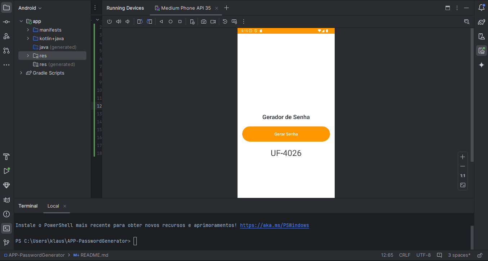

# APP-PasswordGenerator
### Um gerador de senhas seguro e fácil de usar para Android



**APP-PasswordGenerator** é um aplicativo Android que permite gerar senhas no formato [XY-0000]. Com uma interface simples, é ideal para iniciantes em Android e Kotlin usarem como base de estudo.

## Funcionalidades
- 🔒 **Gerador de Senha Aleatória**: Gera senhas únicas, compostas por duas letras maiúsculas e um número de quatro dígitos.

## Tecnologias Utilizadas
- **Kotlin** - Linguagem de programação principal do aplicativo.
- **Android Studio** - IDE usada para o desenvolvimento.

## Como Funciona
O app utiliza o conceito de *view binding*, o que simplifica a comunicação entre o código e a interface. A cada clique no botão "Gerar Senha", o app seleciona duas letras aleatórias de um array (`letter`) e um número de quatro dígitos, combinando-os no formato `[XY-0000]`. O resultado é exibido na interface, acessando diretamente o campo de texto com o *binding*, facilitando o uso e a atualização de valores na tela.

## Como Usar
1. Clone este repositório:
   ```bash
   git clone https://github.com/KlausKurth/APP-PasswordGenerator.git
